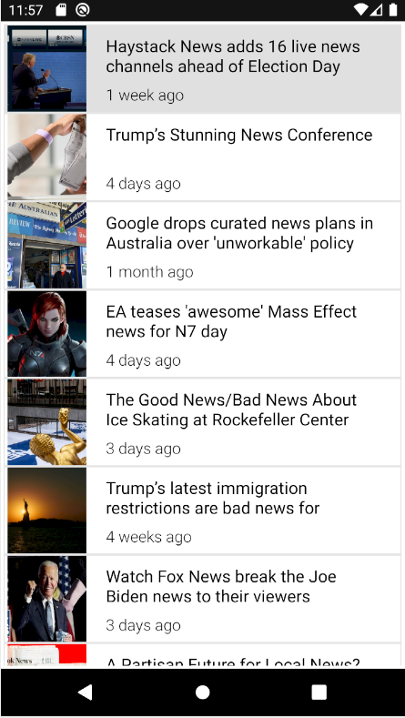

# NewsApp
It uses newsapi.org API to get news and get JSON data back.Then it is parsed using google's gson library and the requests are sent by Retrofit.

**Note: To run the app you have to add [NewsAPI.org](https://newsapi.org/) key. I have taken this step to due to limited access to daily request for News. Getting a key would take just few seconds :)**
# App Screenshot

